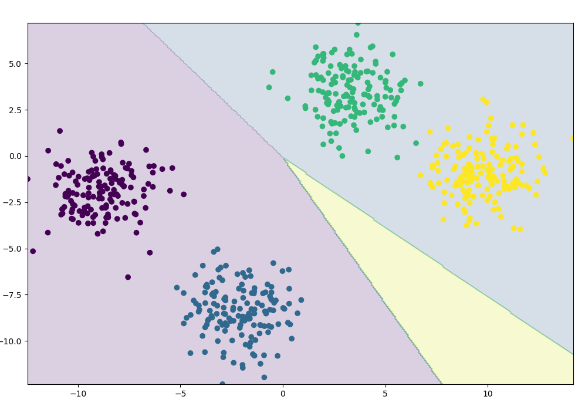
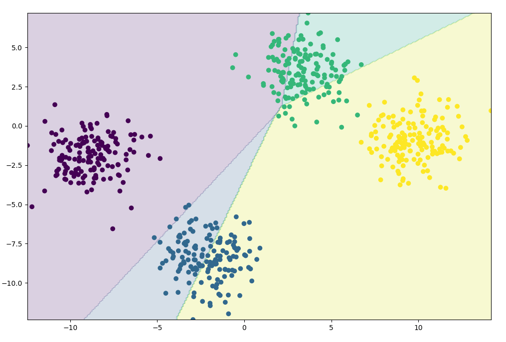
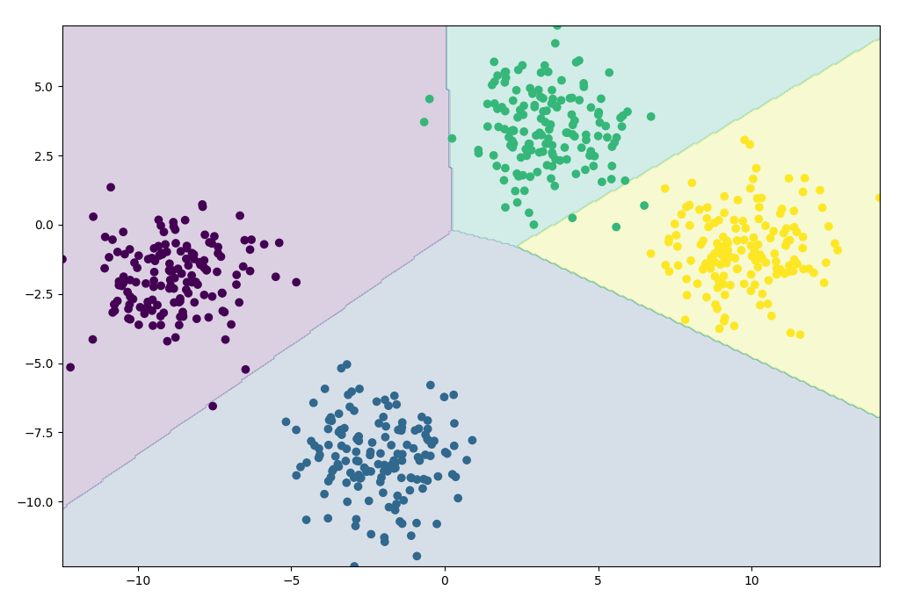
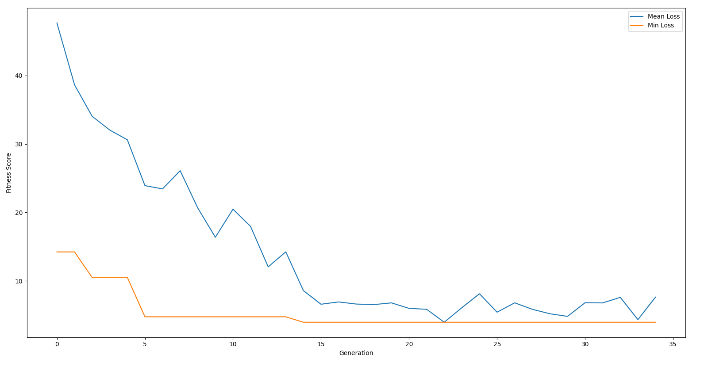

# Genetic-Neural-Network
A simple hybrid of NN and GA - GNN. Everything is made from scratch (without PyTorch, Tensorflow/Keras, DEAP, etc); only numpy and scikit (just to create the blobs dataset) 

## About the NN
Previous neural network structure: 
`Linear 2 in 8 out -> ReLU -> Linear 8 in 8 out -> ReLU -> Linear 8 in 4 out -> Softmax` 
And since the data (blobs) is linearly separable, the neural network was performing poorly with ReLU activation layers. So I removed them leaving the model with following form: 
`Linear 2 in 8 out -> Linear 8 in 8 out -> Linear 8 in 4 out -> Softmax` 

## About the GA
- **Crossover**: 
    My implementation uses pretty simple uniform crossover. Firstly it flattens all weights of the parents and randomly combines them (along with biases) in order to generate an offspring, respectively a new neural network.
- **Mutation**: 
    Takes weights between two random layers and changes them with some chance, the same goes for biases. Note: the chance of a weight/bias changing and a mutation chance are two different things. Actually, the first one is a "magic number" - 0.6
- **Selection**: 
    Just a Roulette Wheel Selection.
- **Fitness Function**: 
    As a fitness function I use Cross Entropy Loss that belongs to the NN class (cross_entropy method).

## Visualized Evolving Process
Some plotting to demonstrate a decision boundary in the evolving process.
- **Generations:** *35*
- **Pop size:** *30*
- **Selector (how many individuals will be substituted):** *15*
- **Mutation chance:** *20%*

### Primal State (Generation #0)
As you can see, it has completely random boundary. 

### Middle State (Generation #9)
The GNN has made some progress. 

### Final State (Generation #14)
Now it can classify our blobs fairly good. 

### Loss During The Process
Here is a visualization of mean and min losses during the evolving. According to the plot, results had stopped improving after 14th generation. 

## (Very) Brief Summary
In my opinion, there're not many suitable cases to use GNN (honestly, I can't come up with any at all, but maybe it's due to the lack of experience). For mostly every problem you can use either GA or NN. Also it's possible to define most optimal hyperparameters for NN using GA. But replacing the backpropagation mechanism with GA is not a good idea I think.

 *P.S. The code is quite messy since I was planning this project as a little experiment, even though every function/method got my comments on its functionality :)*